# Benchmark report

OpenSSH, Eternal Terminal (ET), mosh and rsh over UDP/TCP are compared on
isolated Docker server/client links. All tables and charts use the
[committed measurement snapshots](docs/bench/data/v0.3.0).

## Measurement scope

Static tests use **four parallel jobs and two evaluations per case**.
Ten network profiles and two full-screen workloads request 60 FPS in 100×30
terminals. The 550 jobs comprise render 200, link-switch 100, echo 100,
bulk-output 100, connectivity 40 and ten-session memory 10 observations.
Every attempted job remains in the data, including failures and missing values.

Moving observations are separate: two evaluations per scene/cohort, each 60 s
with two shared 30-second cycles. Four sessions run concurrently. One cohort
compares SSH/ET/mosh/rsh UDP, the other SSH/ET/mosh/rsh TCP; their shared
reference tools are not pooled across cohorts. A 403×32 virtual viewer is
drained continuously, with actual 100×30 workload PTYs checked separately.

**1% low, 5% low and average FPS are primary; CPU/RSS are secondary.**
No aggregate score or universal advantage follows from one metric.

### Environment and workloads

The shared host has an Apple M5 with four performance cores, six efficiency
cores and 32 GiB RAM. Four jobs do not establish physical core affinity. The
[environment manifest](docs/bench/data/v0.3.0/environment.json) records the
host/VM, package versions, executable identities and actual test commands.
Other local services remain running; host scheduling can vary.

Each job has its own shaped link. `compress` is a compressible full-screen
dashboard; `bandwidth` changes every cell with random content. SSH/ET frame
headers in static tests are observed in the raw-output reader; mosh/rsh headers are observed
after pyte reconstructs terminal differences. Header arrival can precede
remaining cells, and emulator scheduling contributes to these measurements.
These are terminal-observer results, not GPU presentation or a complete-body
oracle. No historical dataset supplies values to the tables below.

### Metrics and aggregation

- **Avg FPS** is the arithmetic mean of each run's displayed frames divided
  by its observation duration. **Median FPS** is the median of those run
  averages. The opening table shows both; FPS charts use the median.
- **1% / 5% low** are `1000 / p99(gap_ms)` and `1000 / p95(gap_ms)` using
  nearest-rank percentiles over available runs' inter-frame gaps pooled
  together. They are percentile reciprocals, not averages of the slowest
  one/five percent. Startup/end boundary gaps are excluded from lows.
- **Age** is the median of each run's median generation-to-observation
  time; it includes processing and queueing and is not RTT. Static windows
  begin at the first observed frame; late backlog is not drained into FPS.
- **Network** is received interface traffic at the client, in decimal
  kbit/s, including protocol overhead. KiB/frame is computed per run and
  then medianed. Packet counts include inbound and outbound interface
  traffic. These are not payload-only byte counts.
- **RSS** is a halfway-through-render sample, in MiB (KiB / 1024), medianed
  across runs; not peak RSS or PSS. Client and server are separate. Server
  process selection includes sshd's listener, ET's shared daemon and
  terminal, mosh-server, or rsh's shared serve process; shells are excluded.
- Other scalar values are medians of available results. Successful/total
  counts, timeouts and collection failures are preserved below. A missing
  observation is never a zero or proof of successful recovery.
- CPU is percent of one core over a render window, not total machine load.
  The collector's `torn` counter can double-count observations;
  it is not used as a count of visible defects in this report.

Metric implementations: [agent.py](benchmark/lab/agent.py),
[pooled lows and summaries](benchmark/lab/lab.py),
[original charts](benchmark/lab/charts.py), and
[report generator](benchmark/lab/report.py).

### Static network profiles

`tc netem` applies delay and independent random loss in both directions;
rate limits below apply server → client. RTT is the nominal delay total,
before queueing. No bandwidth cap means no configured rate limit.


| Profile | Conditions |
| --- | --- |
| lan | LAN |
| wan | RTT 100 ms |
| mid5 | 5 Mbit/s · RTT 100 ms |
| lowbw | 1 Mbit/s · RTT 100 ms |
| verylow | 256 kbit/s · RTT 100 ms |
| slow64k | 64 kbit/s · RTT 100 ms |
| mobile | 512 kbit/s · RTT 200 ms · 1% loss |
| badmobile | 256 kbit/s · RTT 400 ms · 2% loss |
| highlat | RTT 300 ms |
| lossy | 2% loss · RTT 100 ms |

## 1. Dashboard rendering

Light bars show median FPS, medium bars 5% low and solid bars 1% low.
All five transports and all ten static profiles are included; two runs per case were attempted.


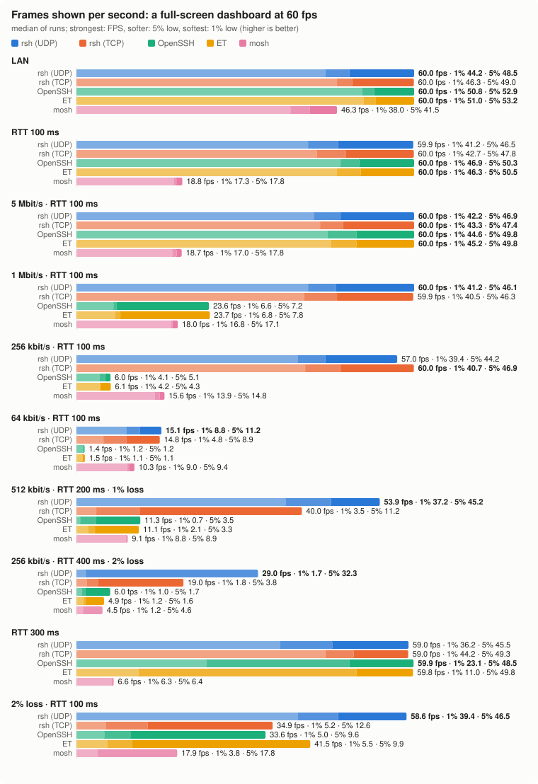

| Link | Tool | Completed | Avg FPS | Median FPS | 1% low | 5% low | Age ms | RX kbit/s | Client RSS MiB | Server RSS MiB |
| --- | --- | --- | --- | --- | --- | --- | --- | --- | --- | --- |
| LAN | rsh (UDP) | 2/2 | 60.0 | 60.0 | 44.2 | 48.5 | 4 | 217 | 2.50 | 5.35 |
| LAN | rsh (TCP) | 2/2 | 60.0 | 60.0 | 46.3 | 49.0 | 3 | 228 | 2.57 | 5.78 |
| LAN | OpenSSH | 2/2 | 60.0 | 60.0 | 50.8 | 52.9 | 1 | 2478 | 7.37 | 18.39 |
| LAN | ET | 2/2 | 60.0 | 60.0 | 51.0 | 53.2 | 1 | 2442 | 18.09 | 15.72 |
| LAN | mosh | 2/2 | 46.3 | 46.3 | 38.0 | 41.5 | 10 | 234 | 15.01 | 10.41 |
| RTT 100 ms | rsh (UDP) | 2/2 | 59.9 | 59.9 | 41.2 | 46.5 | 56 | 217 | 2.51 | 5.16 |
| RTT 100 ms | rsh (TCP) | 2/2 | 60.0 | 60.0 | 42.7 | 47.8 | 54 | 228 | 2.60 | 5.83 |
| RTT 100 ms | OpenSSH | 2/2 | 60.0 | 60.0 | 46.9 | 50.3 | 52 | 2512 | 7.38 | 18.39 |
| RTT 100 ms | ET | 2/2 | 60.0 | 60.0 | 46.3 | 50.5 | 52 | 2468 | 16.30 | 14.18 |
| RTT 100 ms | mosh | 2/2 | 18.8 | 18.8 | 17.3 | 17.8 | 60 | 103 | 14.47 | 10.52 |
| 5 Mbit/s · RTT 100 ms | rsh (UDP) | 2/2 | 60.0 | 60.0 | 42.2 | 46.9 | 56 | 216 | 2.51 | 5.52 |
| 5 Mbit/s · RTT 100 ms | rsh (TCP) | 2/2 | 60.0 | 60.0 | 43.3 | 47.4 | 56 | 228 | 2.57 | 5.79 |
| 5 Mbit/s · RTT 100 ms | OpenSSH | 2/2 | 60.0 | 60.0 | 44.6 | 49.8 | 59 | 2513 | 7.37 | 18.38 |
| 5 Mbit/s · RTT 100 ms | ET | 2/2 | 60.0 | 60.0 | 45.2 | 49.8 | 60 | 2462 | 17.08 | 14.30 |
| 5 Mbit/s · RTT 100 ms | mosh | 2/2 | 18.7 | 18.7 | 17.0 | 17.8 | 62 | 102 | 14.48 | 10.46 |
| 1 Mbit/s · RTT 100 ms | rsh (UDP) | 2/2 | 60.0 | 60.0 | 41.2 | 46.1 | 60 | 218 | 2.49 | 5.03 |
| 1 Mbit/s · RTT 100 ms | rsh (TCP) | 2/2 | 59.9 | 59.9 | 40.5 | 46.3 | 60 | 228 | 2.57 | 5.52 |
| 1 Mbit/s · RTT 100 ms | OpenSSH | 2/2 | 23.6 | 23.6 | 6.6 | 7.2 | 2542 | 977 | 7.51 | 19.27 |
| 1 Mbit/s · RTT 100 ms | ET | 2/2 | 23.7 | 23.7 | 6.8 | 7.8 | 2494 | 976 | 17.07 | 15.24 |
| 1 Mbit/s · RTT 100 ms | mosh | 2/2 | 18.0 | 18.0 | 16.8 | 17.1 | 66 | 98 | 14.53 | 10.46 |
| 256 kbit/s · RTT 100 ms | rsh (UDP) | 2/2 | 57.0 | 57.0 | 39.4 | 44.2 | 72 | 211 | 2.52 | 5.55 |
| 256 kbit/s · RTT 100 ms | rsh (TCP) | 2/2 | 60.0 | 60.0 | 40.7 | 46.9 | 71 | 230 | 2.57 | 5.83 |
| 256 kbit/s · RTT 100 ms | OpenSSH | 2/2 | 6.0 | 6.0 | 4.1 | 5.1 | 3782 | 248 | 7.38 | 19.31 |
| 256 kbit/s · RTT 100 ms | ET | 2/2 | 6.1 | 6.1 | 4.2 | 4.3 | 3726 | 248 | 18.07 | 14.32 |
| 256 kbit/s · RTT 100 ms | mosh | 2/2 | 15.6 | 15.6 | 13.9 | 14.8 | 84 | 88 | 14.35 | 10.43 |
| 64 kbit/s · RTT 100 ms | rsh (UDP) | 2/2 | 15.1 | 15.1 | 8.8 | 11.2 | 118 | 57 | 2.51 | 6.54 |
| 64 kbit/s · RTT 100 ms | rsh (TCP) | 2/2 | 14.8 | 14.8 | 4.8 | 8.9 | 242 | 64 | 2.59 | 5.72 |
| 64 kbit/s · RTT 100 ms | OpenSSH | 2/2 | 1.4 | 1.4 | 1.2 | 1.2 | 4214 | 62 | 7.36 | 19.29 |
| 64 kbit/s · RTT 100 ms | ET | 2/2 | 1.5 | 1.5 | 1.1 | 1.1 | 4644 | 62 | 16.53 | 13.89 |
| 64 kbit/s · RTT 100 ms | mosh | 2/2 | 10.3 | 10.3 | 9.0 | 9.4 | 154 | 58 | 14.48 | 10.41 |
| 512 kbit/s · RTT 200 ms · 1% loss | rsh (UDP) | 2/2 | 53.9 | 53.9 | 37.2 | 45.2 | 114 | 237 | 2.62 | 5.56 |
| 512 kbit/s · RTT 200 ms · 1% loss | rsh (TCP) | 2/2 | 40.0 | 40.0 | 3.5 | 11.2 | 118 | 201 | 2.78 | 6.10 |
| 512 kbit/s · RTT 200 ms · 1% loss | OpenSSH | 2/2 | 11.3 | 11.3 | 0.7 | 3.5 | 3290 | 496 | 7.56 | 19.48 |
| 512 kbit/s · RTT 200 ms · 1% loss | ET | 2/2 | 11.1 | 11.1 | 2.1 | 3.3 | 3135 | 455 | 17.36 | 13.83 |
| 512 kbit/s · RTT 200 ms · 1% loss | mosh | 2/2 | 9.1 | 9.1 | 8.8 | 8.9 | 122 | 49 | 14.34 | 10.44 |
| 256 kbit/s · RTT 400 ms · 2% loss | rsh (UDP) | 2/2 | 29.0 | 29.0 | 1.7 | 32.3 | 230 | 174 | 2.95 | 5.71 |
| 256 kbit/s · RTT 400 ms · 2% loss | rsh (TCP) | 1/2 | 19.0 | 19.0 | 1.8 | 3.8 | 240 | 139 | 2.88 | 5.36 |
| 256 kbit/s · RTT 400 ms · 2% loss | OpenSSH | 2/2 | 6.0 | 6.0 | 1.0 | 1.7 | 4401 | 249 | 7.58 | 19.50 |
| 256 kbit/s · RTT 400 ms · 2% loss | ET | 2/2 | 4.9 | 4.9 | 1.2 | 1.6 | 4678 | 204 | 17.16 | 13.42 |
| 256 kbit/s · RTT 400 ms · 2% loss | mosh | 2/2 | 4.5 | 4.5 | 1.2 | 4.6 | 234 | 26 | 14.44 | 10.39 |
| RTT 300 ms | rsh (UDP) | 2/2 | 59.0 | 59.0 | 36.2 | 45.5 | 156 | 216 | 2.52 | 5.07 |
| RTT 300 ms | rsh (TCP) | 2/2 | 59.0 | 59.0 | 44.2 | 49.3 | 157 | 235 | 2.64 | 5.73 |
| RTT 300 ms | OpenSSH | 2/2 | 59.9 | 59.9 | 23.1 | 48.5 | 152 | 2502 | 7.44 | 18.46 |
| RTT 300 ms | ET | 2/2 | 59.8 | 59.8 | 11.0 | 49.8 | 152 | 2466 | 17.39 | 15.49 |
| RTT 300 ms | mosh | 2/2 | 6.6 | 6.6 | 6.3 | 6.4 | 161 | 37 | 14.55 | 10.31 |
| 2% loss · RTT 100 ms | rsh (UDP) | 2/2 | 58.6 | 58.6 | 39.4 | 46.5 | 56 | 414 | 2.63 | 5.59 |
| 2% loss · RTT 100 ms | rsh (TCP) | 2/2 | 34.9 | 34.9 | 5.2 | 12.6 | 59 | 163 | 2.70 | 5.91 |
| 2% loss · RTT 100 ms | OpenSSH | 2/2 | 33.6 | 33.6 | 5.0 | 9.6 | 1892 | 1373 | 7.52 | 19.31 |
| 2% loss · RTT 100 ms | ET | 2/2 | 41.5 | 41.5 | 5.5 | 9.9 | 812 | 1695 | 17.71 | 14.46 |
| 2% loss · RTT 100 ms | mosh | 2/2 | 17.9 | 17.9 | 3.8 | 17.8 | 61 | 103 | 14.82 | 10.55 |

## 2. Random full-screen rendering

Every cell changes each frame. This workload compresses less effectively
and exposes a different bandwidth and frame-gap tradeoff than the dashboard.


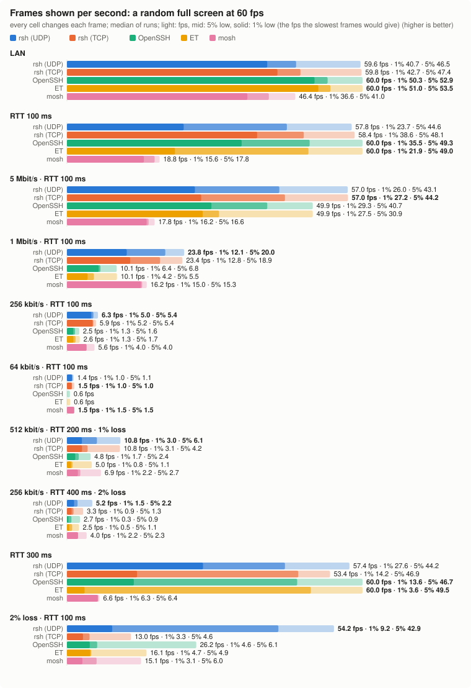

| Link | Tool | Completed | Avg FPS | Median FPS | 1% low | 5% low | Age ms | RX kbit/s | Client RSS MiB | Server RSS MiB |
| --- | --- | --- | --- | --- | --- | --- | --- | --- | --- | --- |
| LAN | rsh (UDP) | 2/2 | 59.6 | 59.6 | 40.7 | 46.5 | 5 | 2666 | 2.53 | 6.18 |
| LAN | rsh (TCP) | 2/2 | 59.8 | 59.8 | 42.7 | 47.4 | 6 | 2717 | 2.58 | 5.20 |
| LAN | OpenSSH | 2/2 | 60.0 | 60.0 | 50.3 | 52.9 | 2 | 5780 | 7.39 | 18.43 |
| LAN | ET | 2/2 | 60.0 | 60.0 | 51.0 | 53.5 | 2 | 5706 | 18.09 | 16.23 |
| LAN | mosh | 2/2 | 46.4 | 46.4 | 36.6 | 41.0 | 12 | 2012 | 15.14 | 10.51 |
| RTT 100 ms | rsh (UDP) | 2/2 | 57.8 | 57.8 | 23.7 | 44.6 | 56 | 2682 | 2.62 | 5.94 |
| RTT 100 ms | rsh (TCP) | 2/2 | 58.4 | 58.4 | 38.6 | 48.1 | 59 | 2274 | 2.62 | 5.29 |
| RTT 100 ms | OpenSSH | 2/2 | 60.0 | 60.0 | 35.5 | 49.3 | 52 | 5814 | 7.47 | 18.50 |
| RTT 100 ms | ET | 2/2 | 60.0 | 60.0 | 21.9 | 49.0 | 52 | 5748 | 18.18 | 16.74 |
| RTT 100 ms | mosh | 2/2 | 18.8 | 18.8 | 15.6 | 17.8 | 62 | 813 | 14.40 | 10.45 |
| 5 Mbit/s · RTT 100 ms | rsh (UDP) | 2/2 | 57.0 | 57.0 | 26.0 | 43.1 | 66 | 2679 | 2.58 | 5.89 |
| 5 Mbit/s · RTT 100 ms | rsh (TCP) | 2/2 | 57.0 | 57.0 | 27.2 | 44.2 | 68 | 2295 | 2.60 | 5.27 |
| 5 Mbit/s · RTT 100 ms | OpenSSH | 2/2 | 49.9 | 49.9 | 29.3 | 40.7 | 790 | 4844 | 7.39 | 18.48 |
| 5 Mbit/s · RTT 100 ms | ET | 2/2 | 49.9 | 49.9 | 27.5 | 30.9 | 813 | 4817 | 17.14 | 17.10 |
| 5 Mbit/s · RTT 100 ms | mosh | 2/2 | 17.8 | 17.8 | 16.2 | 16.6 | 70 | 769 | 14.43 | 10.42 |
| 1 Mbit/s · RTT 100 ms | rsh (UDP) | 2/2 | 23.8 | 23.8 | 12.1 | 20.0 | 100 | 916 | 2.52 | 5.74 |
| 1 Mbit/s · RTT 100 ms | rsh (TCP) | 2/2 | 23.4 | 23.4 | 12.8 | 18.9 | 120 | 954 | 2.59 | 5.73 |
| 1 Mbit/s · RTT 100 ms | OpenSSH | 2/2 | 10.1 | 10.1 | 6.4 | 6.8 | 3496 | 979 | 7.40 | 19.59 |
| 1 Mbit/s · RTT 100 ms | ET | 2/2 | 10.1 | 10.1 | 4.2 | 5.5 | 3250 | 977 | 17.10 | 14.28 |
| 1 Mbit/s · RTT 100 ms | mosh | 2/2 | 16.2 | 16.2 | 15.0 | 15.3 | 106 | 700 | 14.49 | 10.48 |
| 256 kbit/s · RTT 100 ms | rsh (UDP) | 2/2 | 6.3 | 6.3 | 5.0 | 5.4 | 220 | 242 | 2.53 | 6.06 |
| 256 kbit/s · RTT 100 ms | rsh (TCP) | 2/2 | 5.9 | 5.9 | 5.2 | 5.4 | 383 | 256 | 2.57 | 5.78 |
| 256 kbit/s · RTT 100 ms | OpenSSH | 2/2 | 2.5 | 2.5 | 1.3 | 1.6 | 3888 | 250 | 7.55 | 19.46 |
| 256 kbit/s · RTT 100 ms | ET | 2/2 | 2.6 | 2.6 | 1.3 | 1.7 | 3954 | 250 | 18.11 | 13.69 |
| 256 kbit/s · RTT 100 ms | mosh | 2/2 | 5.6 | 5.6 | 4.0 | 4.0 | 470 | 239 | 15.05 | 10.94 |
| 64 kbit/s · RTT 100 ms | rsh (UDP) | 2/2 | 1.4 | 1.4 | 1.0 | 1.1 | 564 | 64 | 2.50 | 5.78 |
| 64 kbit/s · RTT 100 ms | rsh (TCP) | 2/2 | 1.5 | 1.5 | 1.0 | 1.0 | 1050 | 63 | 2.56 | 5.68 |
| 64 kbit/s · RTT 100 ms | OpenSSH | 2/2 | 0.6 | 0.6 | — | — | 3920 | 62 | 7.37 | 19.41 |
| 64 kbit/s · RTT 100 ms | ET | 2/2 | 0.6 | 0.6 | — | — | 4901 | 62 | 18.09 | 14.03 |
| 64 kbit/s · RTT 100 ms | mosh | 2/2 | 1.5 | 1.5 | 1.5 | 1.5 | 3976 | 64 | 14.90 | 13.07 |
| 512 kbit/s · RTT 200 ms · 1% loss | rsh (UDP) | 2/2 | 10.8 | 10.8 | 3.0 | 6.1 | 186 | 432 | 2.60 | 6.15 |
| 512 kbit/s · RTT 200 ms · 1% loss | rsh (TCP) | 2/2 | 10.8 | 10.8 | 3.1 | 4.2 | 260 | 467 | 2.60 | 5.74 |
| 512 kbit/s · RTT 200 ms · 1% loss | OpenSSH | 2/2 | 4.8 | 4.8 | 1.7 | 2.4 | 3832 | 466 | 7.57 | 19.67 |
| 512 kbit/s · RTT 200 ms · 1% loss | ET | 2/2 | 5.0 | 5.0 | 0.8 | 1.1 | 3636 | 504 | 17.80 | 14.39 |
| 512 kbit/s · RTT 200 ms · 1% loss | mosh | 2/2 | 6.9 | 6.9 | 2.2 | 2.7 | 200 | 336 | 14.42 | 10.46 |
| 256 kbit/s · RTT 400 ms · 2% loss | rsh (UDP) | 2/2 | 5.2 | 5.2 | 1.5 | 2.2 | 367 | 219 | 2.60 | 5.42 |
| 256 kbit/s · RTT 400 ms · 2% loss | rsh (TCP) | 2/2 | 3.3 | 3.3 | 0.9 | 1.3 | 866 | 219 | 2.71 | 6.55 |
| 256 kbit/s · RTT 400 ms · 2% loss | OpenSSH | 2/2 | 2.7 | 2.7 | 0.3 | 0.9 | 4386 | 251 | 7.44 | 19.69 |
| 256 kbit/s · RTT 400 ms · 2% loss | ET | 2/2 | 2.5 | 2.5 | 0.5 | 1.1 | 4598 | 240 | 16.63 | 13.23 |
| 256 kbit/s · RTT 400 ms · 2% loss | mosh | 2/2 | 4.0 | 4.0 | 2.2 | 2.3 | 382 | 184 | 14.43 | 10.43 |
| RTT 300 ms | rsh (UDP) | 2/2 | 57.4 | 57.4 | 27.6 | 44.2 | 157 | 2710 | 2.64 | 5.75 |
| RTT 300 ms | rsh (TCP) | 2/2 | 53.4 | 53.4 | 14.2 | 46.9 | 159 | 2122 | 2.72 | 5.83 |
| RTT 300 ms | OpenSSH | 2/2 | 60.0 | 60.0 | 13.6 | 46.7 | 152 | 5794 | 7.80 | 18.62 |
| RTT 300 ms | ET | 2/2 | 60.0 | 60.0 | 3.6 | 49.5 | 153 | 5721 | 17.68 | 16.46 |
| RTT 300 ms | mosh | 2/2 | 6.6 | 6.6 | 6.3 | 6.4 | 162 | 283 | 14.32 | 10.19 |
| 2% loss · RTT 100 ms | rsh (UDP) | 2/2 | 54.2 | 54.2 | 9.2 | 42.9 | 57 | 5104 | 2.89 | 5.87 |
| 2% loss · RTT 100 ms | rsh (TCP) | 2/2 | 13.0 | 13.0 | 3.3 | 4.6 | 89 | 775 | 2.69 | 5.97 |
| 2% loss · RTT 100 ms | OpenSSH | 2/2 | 26.2 | 26.2 | 4.6 | 6.1 | 1658 | 2548 | 7.64 | 19.15 |
| 2% loss · RTT 100 ms | ET | 2/2 | 16.1 | 16.1 | 4.7 | 4.9 | 663 | 1564 | 18.17 | 15.72 |
| 2% loss · RTT 100 ms | mosh | 2/2 | 15.1 | 15.1 | 3.1 | 6.0 | 62 | 797 | 14.38 | 10.91 |

## 3. Frame age

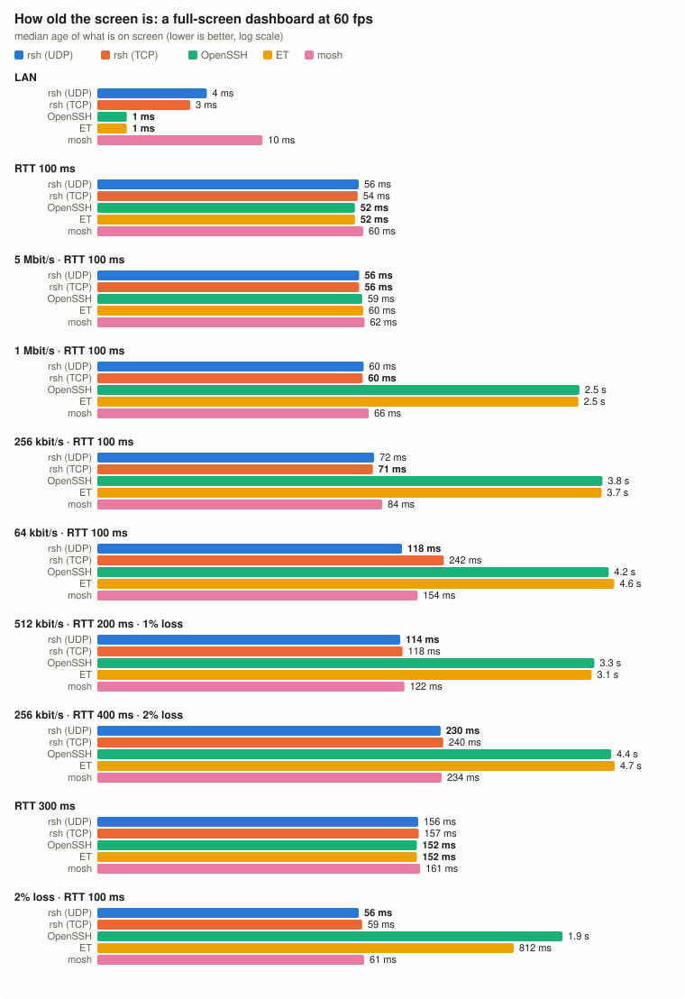

The rendering tables above include age for both scenes. The chart uses a log scale.

## 4. Network traffic and CPU

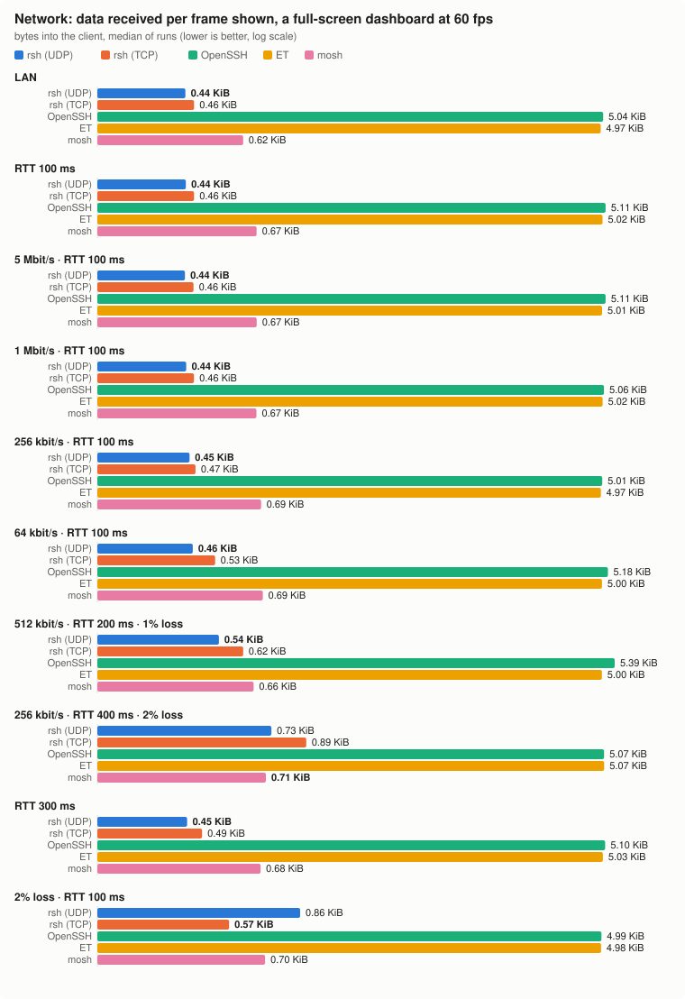

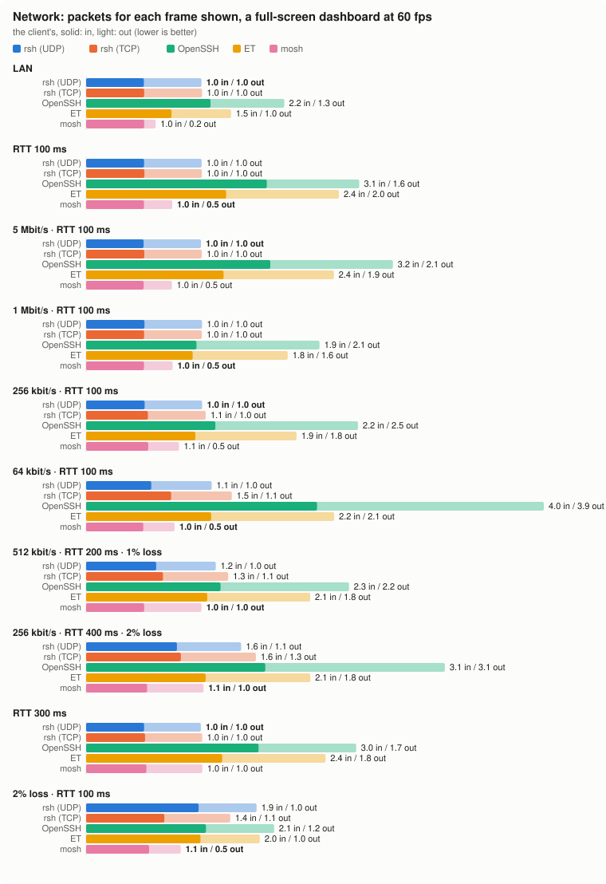

The render tables give RX kbit/s. Below: median per-run bytes/frame, packets/frame and CPU for each scene.

### Dashboard

| Link | Tool | RX KiB/frame | Packets in/frame | Packets out/frame | Client CPU % | Server CPU % |
| --- | --- | --- | --- | --- | --- | --- |
| lan | rsh (UDP) | 0.44 | 1.00 | 1.00 | 1.23 | 1.62 |
| lan | rsh (TCP) | 0.46 | 1.01 | 1.00 | 0.88 | 1.12 |
| lan | OpenSSH | 5.04 | 2.16 | 1.28 | 0.41 | 0.60 |
| lan | ET | 4.97 | 1.48 | 1.03 | 0.91 | 0.93 |
| lan | mosh | 0.62 | 1.01 | 0.20 | 1.33 | 2.66 |
| wan | rsh (UDP) | 0.44 | 1.01 | 1.00 | 1.40 | 1.92 |
| wan | rsh (TCP) | 0.46 | 1.01 | 1.00 | 1.06 | 1.40 |
| wan | OpenSSH | 5.11 | 3.13 | 1.60 | 0.33 | 0.37 |
| wan | ET | 5.02 | 2.43 | 1.95 | 0.59 | 0.80 |
| wan | mosh | 0.67 | 1.00 | 0.49 | 0.73 | 2.40 |
| mid5 | rsh (UDP) | 0.44 | 1.00 | 0.99 | 1.46 | 1.99 |
| mid5 | rsh (TCP) | 0.46 | 1.01 | 1.00 | 1.17 | 1.48 |
| mid5 | OpenSSH | 5.11 | 3.19 | 2.12 | 0.68 | 0.42 |
| mid5 | ET | 5.01 | 2.38 | 1.91 | 0.84 | 0.71 |
| mid5 | mosh | 0.67 | 1.00 | 0.49 | 0.69 | 2.26 |
| lowbw | rsh (UDP) | 0.44 | 1.01 | 1.00 | 1.46 | 2.10 |
| lowbw | rsh (TCP) | 0.46 | 1.01 | 1.00 | 1.39 | 1.65 |
| lowbw | OpenSSH | 5.06 | 1.91 | 2.13 | 0.24 | 0.60 |
| lowbw | ET | 5.02 | 1.85 | 1.65 | 0.43 | 0.86 |
| lowbw | mosh | 0.67 | 1.00 | 0.50 | 0.70 | 2.47 |
| verylow | rsh (UDP) | 0.45 | 1.01 | 1.00 | 1.53 | 3.19 |
| verylow | rsh (TCP) | 0.47 | 1.07 | 1.00 | 1.39 | 1.94 |
| verylow | OpenSSH | 5.01 | 2.24 | 2.47 | 0.17 | 0.53 |
| verylow | ET | 4.97 | 1.89 | 1.75 | 0.49 | 1.02 |
| verylow | mosh | 0.69 | 1.08 | 0.53 | 0.84 | 3.20 |
| slow64k | rsh (UDP) | 0.46 | 1.13 | 1.05 | 0.65 | 2.50 |
| slow64k | rsh (TCP) | 0.53 | 1.47 | 1.05 | 0.70 | 2.36 |
| slow64k | OpenSSH | 5.18 | 4.00 | 3.93 | 0.11 | 0.84 |
| slow64k | ET | 5.00 | 2.17 | 2.13 | 0.60 | 1.20 |
| slow64k | mosh | 0.69 | 0.99 | 0.54 | 0.73 | 4.34 |
| mobile | rsh (UDP) | 0.54 | 1.21 | 1.03 | 1.59 | 2.21 |
| mobile | rsh (TCP) | 0.62 | 1.33 | 1.13 | 1.23 | 4.28 |
| mobile | OpenSSH | 5.39 | 2.33 | 2.23 | 0.14 | 0.79 |
| mobile | ET | 5.00 | 2.10 | 1.78 | 0.47 | 0.91 |
| mobile | mosh | 0.66 | 1.01 | 0.99 | 0.51 | 2.98 |
| badmobile | rsh (UDP) | 0.73 | 1.57 | 1.11 | 1.34 | 4.62 |
| badmobile | rsh (TCP) | 0.89 | 1.64 | 1.30 | 0.83 | 3.50 |
| badmobile | OpenSSH | 5.07 | 3.11 | 3.11 | 0.20 | 1.01 |
| badmobile | ET | 5.07 | 2.07 | 1.81 | 0.47 | 0.92 |
| badmobile | mosh | 0.71 | 1.06 | 0.98 | 0.29 | 2.79 |
| highlat | rsh (UDP) | 0.45 | 1.01 | 0.98 | 1.65 | 2.14 |
| highlat | rsh (TCP) | 0.49 | 1.02 | 0.99 | 1.27 | 4.12 |
| highlat | OpenSSH | 5.10 | 2.99 | 1.69 | 0.41 | 0.46 |
| highlat | ET | 5.03 | 2.36 | 1.79 | 0.73 | 0.92 |
| highlat | mosh | 0.68 | 1.05 | 0.97 | 0.33 | 2.31 |
| lossy | rsh (UDP) | 0.86 | 1.95 | 1.01 | 1.33 | 1.80 |
| lossy | rsh (TCP) | 0.57 | 1.36 | 1.14 | 0.78 | 2.90 |
| lossy | OpenSSH | 4.99 | 2.08 | 1.18 | 0.16 | 0.84 |
| lossy | ET | 4.98 | 1.98 | 1.03 | 0.38 | 0.64 |
| lossy | mosh | 0.70 | 1.09 | 0.55 | 0.67 | 2.27 |

### Random screen

| Link | Tool | RX KiB/frame | Packets in/frame | Packets out/frame | Client CPU % | Server CPU % |
| --- | --- | --- | --- | --- | --- | --- |
| lan | rsh (UDP) | 5.46 | 4.90 | 1.00 | 1.59 | 2.38 |
| lan | rsh (TCP) | 5.55 | 4.88 | 2.28 | 1.64 | 2.16 |
| lan | OpenSSH | 11.76 | 3.19 | 1.84 | 0.34 | 0.43 |
| lan | ET | 11.61 | 1.70 | 1.65 | 0.57 | 0.93 |
| lan | mosh | 5.30 | 4.99 | 0.20 | 3.03 | 5.01 |
| wan | rsh (UDP) | 5.66 | 5.09 | 1.01 | 1.75 | 2.45 |
| wan | rsh (TCP) | 4.75 | 4.01 | 2.03 | 1.77 | 6.42 |
| wan | OpenSSH | 11.83 | 4.03 | 1.72 | 0.43 | 0.46 |
| wan | ET | 11.70 | 2.93 | 2.02 | 0.61 | 0.83 |
| wan | mosh | 5.28 | 4.97 | 0.49 | 1.45 | 3.94 |
| mid5 | rsh (UDP) | 5.74 | 5.16 | 2.10 | 2.16 | 2.33 |
| mid5 | rsh (TCP) | 4.91 | 4.91 | 3.52 | 2.39 | 6.48 |
| mid5 | OpenSSH | 11.85 | 4.55 | 4.11 | 0.67 | 0.38 |
| mid5 | ET | 11.78 | 4.47 | 3.72 | 0.65 | 0.69 |
| mid5 | mosh | 5.27 | 4.97 | 0.49 | 1.34 | 3.81 |
| lowbw | rsh (UDP) | 4.70 | 4.04 | 4.02 | 1.61 | 3.58 |
| lowbw | rsh (TCP) | 4.96 | 5.83 | 4.20 | 1.64 | 3.66 |
| lowbw | OpenSSH | 11.83 | 4.53 | 4.85 | 0.23 | 0.42 |
| lowbw | ET | 11.75 | 4.34 | 3.81 | 0.41 | 0.75 |
| lowbw | mosh | 5.28 | 4.98 | 0.50 | 1.74 | 4.50 |
| verylow | rsh (UDP) | 4.68 | 4.51 | 4.50 | 0.98 | 3.44 |
| verylow | rsh (TCP) | 5.30 | 8.51 | 7.42 | 0.93 | 2.33 |
| verylow | OpenSSH | 12.21 | 5.24 | 5.42 | 0.17 | 0.34 |
| verylow | ET | 11.76 | 4.42 | 4.02 | 0.49 | 1.53 |
| verylow | mosh | 5.21 | 4.93 | 0.98 | 1.39 | 6.08 |
| slow64k | rsh (UDP) | 5.91 | 13.76 | 13.23 | 0.51 | 1.71 |
| slow64k | rsh (TCP) | 5.13 | 8.03 | 5.83 | 0.26 | 1.65 |
| slow64k | OpenSSH | 12.61 | 6.75 | 7.75 | 0.13 | 0.30 |
| slow64k | ET | 11.71 | 4.49 | 4.43 | 0.52 | 0.46 |
| slow64k | mosh | 5.17 | 4.80 | 1.00 | 0.29 | 5.50 |
| mobile | rsh (UDP) | 4.86 | 4.22 | 4.07 | 0.98 | 2.88 |
| mobile | rsh (TCP) | 5.31 | 6.08 | 4.28 | 1.06 | 3.04 |
| mobile | OpenSSH | 11.85 | 5.86 | 6.04 | 0.21 | 0.58 |
| mobile | ET | 12.18 | 5.67 | 5.57 | 0.42 | 0.79 |
| mobile | mosh | 5.95 | 5.61 | 0.99 | 0.99 | 4.92 |
| badmobile | rsh (UDP) | 5.21 | 4.51 | 4.23 | 0.66 | 2.12 |
| badmobile | rsh (TCP) | 8.17 | 6.52 | 5.66 | 0.45 | 2.56 |
| badmobile | OpenSSH | 11.57 | 6.22 | 5.70 | 0.11 | 0.50 |
| badmobile | ET | 11.93 | 5.04 | 4.50 | 0.45 | 0.95 |
| badmobile | mosh | 5.60 | 5.33 | 1.00 | 0.71 | 5.56 |
| highlat | rsh (UDP) | 5.77 | 5.18 | 1.04 | 2.00 | 2.31 |
| highlat | rsh (TCP) | 4.85 | 4.07 | 2.06 | 1.65 | 5.93 |
| highlat | OpenSSH | 11.79 | 3.35 | 1.96 | 0.39 | 0.42 |
| highlat | ET | 11.64 | 2.51 | 1.84 | 0.59 | 0.79 |
| highlat | mosh | 5.23 | 5.06 | 1.12 | 0.53 | 3.41 |
| lossy | rsh (UDP) | 11.51 | 10.35 | 1.08 | 1.82 | 2.42 |
| lossy | rsh (TCP) | 7.39 | 5.06 | 4.02 | 0.95 | 3.06 |
| lossy | OpenSSH | 11.84 | 4.94 | 3.07 | 0.30 | 0.50 |
| lossy | ET | 11.81 | 4.70 | 3.13 | 0.46 | 0.91 |
| lossy | mosh | 6.49 | 6.11 | 0.51 | 1.40 | 4.29 |

## 5. Resident memory

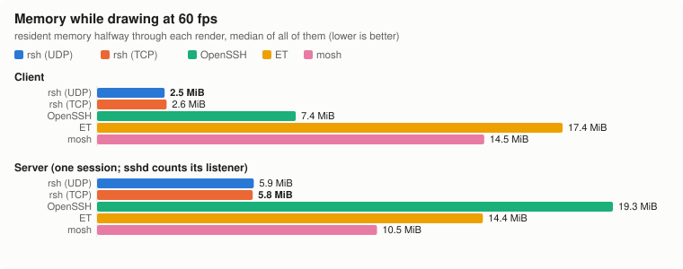

Per-link RSS for both scenes is in sections 1–2. The chart pools the render samples across links and scenes.

### Ten simultaneous sessions

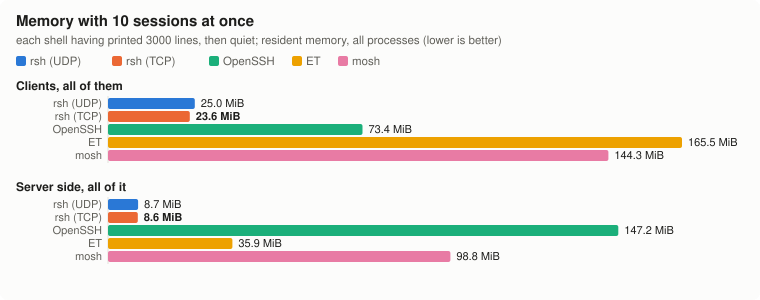

| Tool | Runs | All clients MiB | Server MiB | Idle packets in/s | Idle packets out/s |
| --- | --- | --- | --- | --- | --- |
| rsh (UDP) | 2 | 25.02 | 8.68 | 2.00 | 2.00 |
| rsh (TCP) | 2 | 23.60 | 8.61 | 2.00 | 4.00 |
| OpenSSH | 2 | 73.41 | 147.16 | 0.00 | 0.00 |
| ET | 2 | 165.55 | 35.88 | 7.10 | 7.80 |
| mosh | 2 | 144.32 | 98.76 | 3.00 | 3.45 |

Each shell prints 3,000 lines, then becomes quiet. Packet rates are totals for the container's ten sessions. Both rsh transports have ten-session observations.

## 6. Connection and key echo

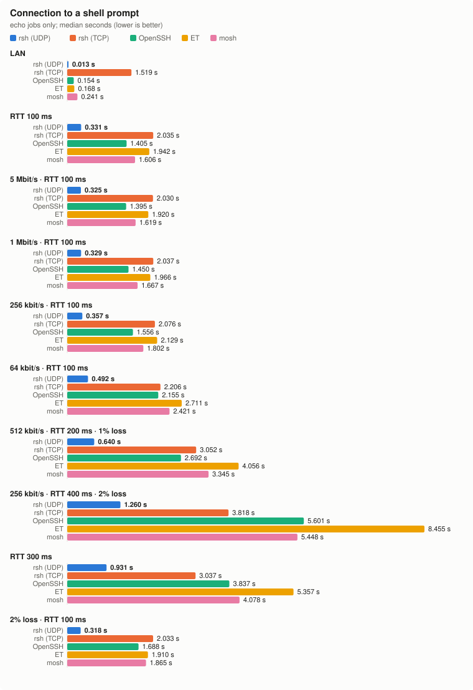

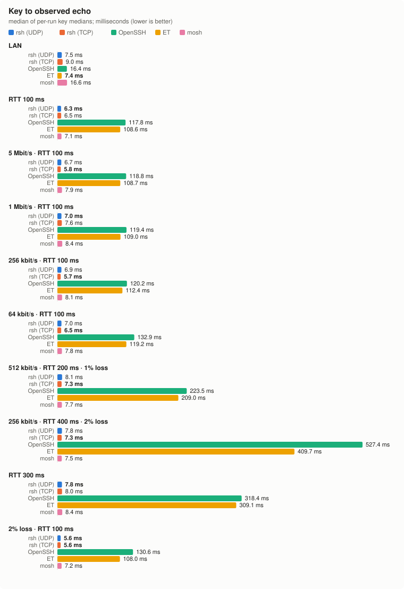

| Link | Tool | Echo runs | Connect s | Echo ms | Echo max ms | Packets in/key | Packets out/key |
| --- | --- | --- | --- | --- | --- | --- | --- |
| lan | rsh (UDP) | 2/2 | 0.013 | 7.5 | 10.9 | 1.1 | 2.2 |
| lan | rsh (TCP) | 2/2 | 1.519 | 9.0 | 13.2 | 3.3 | 2.2 |
| lan | OpenSSH | 2/2 | 0.154 | 16.4 | 24.9 | 15.9 | 15.9 |
| lan | ET | 2/2 | 0.168 | 7.4 | 11.0 | 2.2 | 3.0 |
| lan | mosh | 2/2 | 0.241 | 16.6 | 21.2 | 2.5 | 2.2 |
| wan | rsh (UDP) | 2/2 | 0.331 | 6.3 | 108.8 | 1.1 | 2.3 |
| wan | rsh (TCP) | 2/2 | 2.035 | 6.5 | 109.2 | 3.3 | 2.3 |
| wan | OpenSSH | 2/2 | 1.405 | 117.8 | 130.3 | 21.1 | 22.0 |
| wan | ET | 2/2 | 1.942 | 108.6 | 111.9 | 1.2 | 2.4 |
| wan | mosh | 2/2 | 1.606 | 7.1 | 119.2 | 2.3 | 2.8 |
| mid5 | rsh (UDP) | 2/2 | 0.325 | 6.7 | 108.5 | 1.1 | 2.3 |
| mid5 | rsh (TCP) | 2/2 | 2.030 | 5.8 | 110.9 | 3.3 | 2.3 |
| mid5 | OpenSSH | 2/2 | 1.395 | 118.8 | 126.6 | 21.4 | 23.3 |
| mid5 | ET | 2/2 | 1.920 | 108.7 | 112.9 | 1.1 | 2.3 |
| mid5 | mosh | 2/2 | 1.619 | 7.9 | 122.9 | 2.3 | 2.8 |
| lowbw | rsh (UDP) | 2/2 | 0.329 | 7.0 | 112.5 | 1.2 | 2.3 |
| lowbw | rsh (TCP) | 2/2 | 2.037 | 7.6 | 109.5 | 3.4 | 2.5 |
| lowbw | OpenSSH | 2/2 | 1.450 | 119.4 | 128.6 | 21.1 | 22.9 |
| lowbw | ET | 2/2 | 1.966 | 109.0 | 114.6 | 1.1 | 2.3 |
| lowbw | mosh | 2/2 | 1.667 | 8.4 | 126.1 | 2.3 | 2.8 |
| verylow | rsh (UDP) | 2/2 | 0.357 | 6.9 | 113.3 | 1.7 | 2.5 |
| verylow | rsh (TCP) | 2/2 | 2.076 | 5.7 | 117.3 | 3.7 | 2.6 |
| verylow | OpenSSH | 2/2 | 1.556 | 120.2 | 134.8 | 19.9 | 20.4 |
| verylow | ET | 2/2 | 2.129 | 112.4 | 131.8 | 1.1 | 2.3 |
| verylow | mosh | 2/2 | 1.802 | 8.1 | 126.0 | 2.7 | 2.7 |
| slow64k | rsh (UDP) | 2/2 | 0.492 | 7.0 | 125.9 | 1.8 | 2.6 |
| slow64k | rsh (TCP) | 2/2 | 2.206 | 6.5 | 138.7 | 3.5 | 2.6 |
| slow64k | OpenSSH | 2/2 | 2.155 | 132.9 | 143.7 | 21.8 | 21.9 |
| slow64k | ET | 2/2 | 2.711 | 119.2 | 123.2 | 1.2 | 2.4 |
| slow64k | mosh | 2/2 | 2.421 | 7.8 | 145.4 | 2.3 | 2.1 |
| mobile | rsh (UDP) | 2/2 | 0.640 | 8.1 | 214.1 | 1.6 | 2.4 |
| mobile | rsh (TCP) | 2/2 | 3.052 | 7.3 | 212.6 | 3.8 | 2.8 |
| mobile | OpenSSH | 2/2 | 2.692 | 223.5 | 380.2 | 24.3 | 28.1 |
| mobile | ET | 2/2 | 4.056 | 209.0 | 214.3 | 1.1 | 2.2 |
| mobile | mosh | 2/2 | 3.345 | 7.7 | 301.2 | 2.4 | 2.5 |
| badmobile | rsh (UDP) | 2/2 | 1.260 | 7.8 | 416.4 | 2.0 | 2.3 |
| badmobile | rsh (TCP) | 2/2 | 3.818 | 7.3 | 420.4 | 3.7 | 3.1 |
| badmobile | OpenSSH | 2/2 | 5.601 | 527.4 | 855.3 | 34.0 | 44.2 |
| badmobile | ET | 2/2 | 8.455 | 409.7 | 414.7 | 1.8 | 2.6 |
| badmobile | mosh | 2/2 | 5.448 | 7.5 | 591.4 | 1.4 | 1.9 |
| highlat | rsh (UDP) | 2/2 | 0.931 | 7.8 | 312.2 | 1.2 | 2.4 |
| highlat | rsh (TCP) | 2/2 | 3.037 | 8.0 | 313.4 | 3.0 | 2.8 |
| highlat | OpenSSH | 2/2 | 3.837 | 318.4 | 330.1 | 31.0 | 32.0 |
| highlat | ET | 2/2 | 5.357 | 309.1 | 316.8 | 1.1 | 2.2 |
| highlat | mosh | 2/2 | 4.078 | 8.4 | 392.4 | 1.9 | 2.2 |
| lossy | rsh (UDP) | 2/2 | 0.318 | 5.6 | 109.0 | 1.4 | 2.5 |
| lossy | rsh (TCP) | 2/2 | 2.033 | 5.6 | 268.7 | 3.6 | 3.0 |
| lossy | OpenSSH | 2/2 | 1.688 | 130.6 | 226.6 | 20.6 | 22.3 |
| lossy | ET | 2/2 | 1.910 | 108.0 | 111.1 | 1.1 | 2.3 |
| lossy | mosh | 2/2 | 1.865 | 7.2 | 192.1 | 2.2 | 2.8 |

Ten keys per run. Echo includes predictive local output for mosh/rsh. Connection times come from these same echo jobs, including their startup path; they are not a new dedicated cold-install test.

## 7. Bulk output

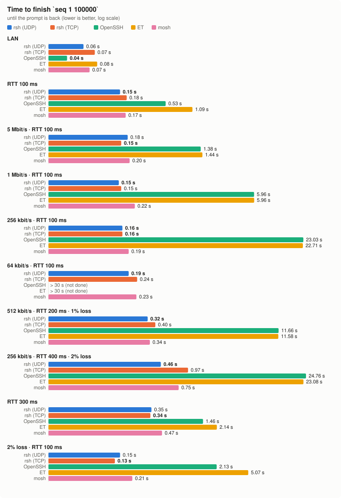

| Link | Tool | Completed | Completion s | 30 s timeouts | Errors | Terminal bytes |
| --- | --- | --- | --- | --- | --- | --- |
| lan | rsh (UDP) | 2/2 | 0.06 | 0 | 0 | 690814 |
| lan | rsh (TCP) | 2/2 | 0.07 | 0 | 0 | 691607 |
| lan | OpenSSH | 2/2 | 0.04 | 0 | 0 | 688960 |
| lan | ET | 2/2 | 0.08 | 0 | 0 | 688960 |
| lan | mosh | 2/2 | 0.07 | 0 | 0 | 800 |
| wan | rsh (UDP) | 2/2 | 0.15 | 0 | 0 | 4100 |
| wan | rsh (TCP) | 2/2 | 0.18 | 0 | 0 | 14076 |
| wan | OpenSSH | 2/2 | 0.53 | 0 | 0 | 688960 |
| wan | ET | 2/2 | 1.09 | 0 | 0 | 688960 |
| wan | mosh | 2/2 | 0.17 | 0 | 0 | 444 |
| mid5 | rsh (UDP) | 2/2 | 0.18 | 0 | 0 | 23024 |
| mid5 | rsh (TCP) | 2/2 | 0.15 | 0 | 0 | 4110 |
| mid5 | OpenSSH | 2/2 | 1.38 | 0 | 0 | 688960 |
| mid5 | ET | 2/2 | 1.44 | 0 | 0 | 688960 |
| mid5 | mosh | 2/2 | 0.20 | 0 | 0 | 482 |
| lowbw | rsh (UDP) | 2/2 | 0.15 | 0 | 0 | 3601 |
| lowbw | rsh (TCP) | 2/2 | 0.15 | 0 | 0 | 4082 |
| lowbw | OpenSSH | 2/2 | 5.96 | 0 | 0 | 688960 |
| lowbw | ET | 2/2 | 5.96 | 0 | 0 | 688960 |
| lowbw | mosh | 2/2 | 0.22 | 0 | 0 | 594 |
| verylow | rsh (UDP) | 2/2 | 0.16 | 0 | 0 | 4083 |
| verylow | rsh (TCP) | 2/2 | 0.16 | 0 | 0 | 2800 |
| verylow | OpenSSH | 2/2 | 23.03 | 0 | 0 | 688960 |
| verylow | ET | 2/2 | 22.71 | 0 | 0 | 688960 |
| verylow | mosh | 2/2 | 0.19 | 0 | 0 | 508 |
| slow64k | rsh (UDP) | 2/2 | 0.19 | 0 | 0 | 3148 |
| slow64k | rsh (TCP) | 2/2 | 0.24 | 0 | 0 | 2800 |
| slow64k | OpenSSH | 0/2 | — | 2 | 0 | 213917 |
| slow64k | ET | 0/2 | — | 2 | 0 | 221078 |
| slow64k | mosh | 2/2 | 0.23 | 0 | 0 | 524 |
| mobile | rsh (UDP) | 2/2 | 0.32 | 0 | 0 | 14388 |
| mobile | rsh (TCP) | 2/2 | 0.40 | 0 | 0 | 26340 |
| mobile | OpenSSH | 2/2 | 11.66 | 0 | 0 | 688960 |
| mobile | ET | 2/2 | 11.58 | 0 | 0 | 688960 |
| mobile | mosh | 2/2 | 0.34 | 0 | 0 | 452 |
| badmobile | rsh (UDP) | 2/2 | 0.46 | 0 | 0 | 2770 |
| badmobile | rsh (TCP) | 1/2 | 0.97 | 0 | 1 | 2818 |
| badmobile | OpenSSH | 2/2 | 24.76 | 0 | 0 | 688965 |
| badmobile | ET | 2/2 | 23.08 | 0 | 0 | 688960 |
| badmobile | mosh | 2/2 | 0.75 | 0 | 0 | 464 |
| highlat | rsh (UDP) | 2/2 | 0.35 | 0 | 0 | 2786 |
| highlat | rsh (TCP) | 2/2 | 0.34 | 0 | 0 | 2320 |
| highlat | OpenSSH | 2/2 | 1.46 | 0 | 0 | 688960 |
| highlat | ET | 2/2 | 2.14 | 0 | 0 | 688960 |
| highlat | mosh | 2/2 | 0.47 | 0 | 0 | 492 |
| lossy | rsh (UDP) | 2/2 | 0.15 | 0 | 0 | 15372 |
| lossy | rsh (TCP) | 2/2 | 0.13 | 0 | 0 | 14428 |
| lossy | OpenSSH | 2/2 | 2.13 | 0 | 0 | 688960 |
| lossy | ET | 2/2 | 5.07 | 0 | 0 | 688960 |
| lossy | mosh | 2/2 | 0.21 | 0 | 0 | 666 |

Completion is the marker after `seq 1 100000`, watched for 30 s. When a case is mixed, completion time covers only completed runs; the counts remain explicit. mosh and rsh may skip intermediate output, so prompt recovery does not imply delivery of the complete byte stream.

## 8. Link changes

Each scene runs two seconds on the first link and eight seconds after the change. FPS before/after is medianed; post-change lows pool only post-change inter-frame gaps. Adaptation is the first whole-second bucket reaching 90% of that tool's own settled FPS, not time to recover 60 FPS.

### Dashboard

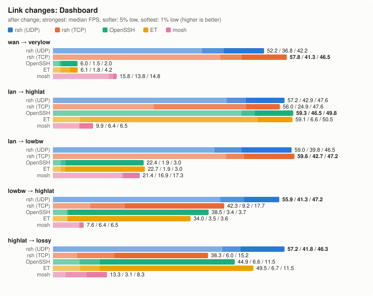

| Change | Tool | Runs | FPS before | FPS after | 1% low after | 5% low after | Age after ms | Adapt s |
| --- | --- | --- | --- | --- | --- | --- | --- | --- |
| wan → verylow | rsh (UDP) | 2/2 | 58.0 | 52.2 | 36.8 | 42.2 | 76 | 1.0 |
| wan → verylow | rsh (TCP) | 2/2 | 58.5 | 57.8 | 41.3 | 46.5 | 72 | 1.0 |
| wan → verylow | OpenSSH | 2/2 | 58.6 | 6.0 | 1.5 | 2.0 | 3708 | 1.5 |
| wan → verylow | ET | 2/2 | 58.3 | 6.1 | 1.8 | 4.2 | 3756 | 2.0 |
| wan → verylow | mosh | 2/2 | 18.1 | 15.8 | 13.8 | 14.8 | 82 | 0.0 |
| lan → highlat | rsh (UDP) | 2/2 | 59.2 | 57.2 | 42.9 | 47.6 | 155 | 1.0 |
| lan → highlat | rsh (TCP) | 2/2 | 59.5 | 56.0 | 24.9 | 47.6 | 156 | 1.0 |
| lan → highlat | OpenSSH | 2/2 | 58.6 | 59.3 | 46.5 | 49.8 | 152 | 1.0 |
| lan → highlat | ET | 2/2 | 58.3 | 59.1 | 6.6 | 50.5 | 152 | 1.0 |
| lan → highlat | mosh | 2/2 | 45.7 | 9.9 | 6.4 | 6.5 | 160 | 0.0 |
| lan → lowbw | rsh (UDP) | 2/2 | 58.9 | 59.0 | 39.8 | 46.5 | 60 | 0.5 |
| lan → lowbw | rsh (TCP) | 2/2 | 59.5 | 59.6 | 42.7 | 47.2 | 60 | 0.0 |
| lan → lowbw | OpenSSH | 2/2 | 59.0 | 22.4 | 1.9 | 3.0 | 2548 | 1.5 |
| lan → lowbw | ET | 2/2 | 58.6 | 22.7 | 1.9 | 3.0 | 2514 | 0.0 |
| lan → lowbw | mosh | 2/2 | 45.5 | 21.4 | 16.9 | 17.3 | 66 | 0.0 |
| lowbw → highlat | rsh (UDP) | 2/2 | 59.2 | 55.9 | 41.3 | 47.2 | 156 | 1.0 |
| lowbw → highlat | rsh (TCP) | 2/2 | 58.9 | 42.3 | 9.2 | 17.7 | 158 | 3.5 |
| lowbw → highlat | OpenSSH | 2/2 | 23.1 | 38.5 | 3.4 | 3.7 | 3652 | 3.0 |
| lowbw → highlat | ET | 2/2 | 23.5 | 34.0 | 3.5 | 3.6 | 1994 | 3.0 |
| lowbw → highlat | mosh | 2/2 | 18.0 | 7.6 | 6.4 | 6.5 | 160 | 0.0 |
| highlat → lossy | rsh (UDP) | 2/2 | 58.9 | 57.2 | 41.8 | 46.3 | 56 | 1.0 |
| highlat → lossy | rsh (TCP) | 2/2 | 54.7 | 38.3 | 6.0 | 15.2 | 60 | 1.0 |
| highlat → lossy | OpenSSH | 2/2 | 58.6 | 44.9 | 6.6 | 11.5 | 202 | 0.0 |
| highlat → lossy | ET | 2/2 | 57.8 | 49.5 | 6.7 | 11.5 | 120 | 0.0 |
| highlat → lossy | mosh | 2/2 | 6.7 | 13.3 | 3.1 | 8.3 | 62 | 3.0 |

### Random screen

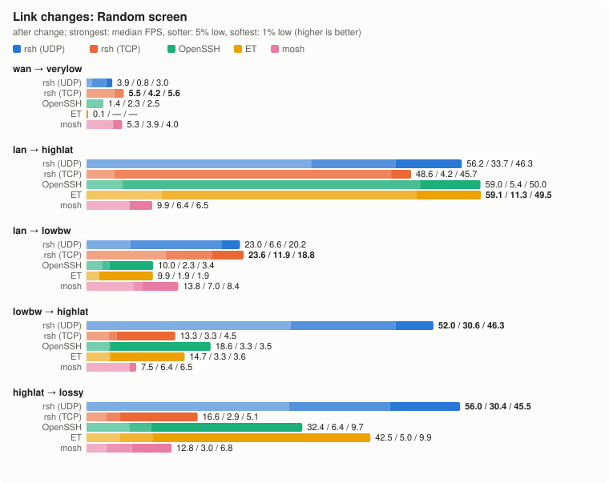

| Change | Tool | Runs | FPS before | FPS after | 1% low after | 5% low after | Age after ms | Adapt s |
| --- | --- | --- | --- | --- | --- | --- | --- | --- |
| wan → verylow | rsh (UDP) | 2/2 | 51.8 | 3.9 | 0.8 | 3.0 | 230 | 3.0 |
| wan → verylow | rsh (TCP) | 2/2 | 52.4 | 5.5 | 4.2 | 5.6 | 451 | 1.0 |
| wan → verylow | OpenSSH | 2/2 | 59.0 | 1.4 | 2.3 | 2.5 | 7192 | 5.0 |
| wan → verylow | ET | 2/2 | 59.0 | 0.1 | — | — | 7686 | — |
| wan → verylow | mosh | 2/2 | 18.4 | 5.3 | 3.9 | 4.0 | 755 | 0.5 |
| lan → highlat | rsh (UDP) | 2/2 | 58.8 | 56.2 | 33.7 | 46.3 | 156 | 1.0 |
| lan → highlat | rsh (TCP) | 2/2 | 59.1 | 48.6 | 4.2 | 45.7 | 160 | 2.0 |
| lan → highlat | OpenSSH | 2/2 | 59.1 | 59.0 | 5.4 | 50.0 | 153 | 1.0 |
| lan → highlat | ET | 2/2 | 59.0 | 59.1 | 11.3 | 49.5 | 153 | 1.0 |
| lan → highlat | mosh | 2/2 | 45.9 | 9.9 | 6.4 | 6.5 | 162 | 0.0 |
| lan → lowbw | rsh (UDP) | 2/2 | 58.3 | 23.0 | 6.6 | 20.2 | 100 | 1.0 |
| lan → lowbw | rsh (TCP) | 2/2 | 59.4 | 23.6 | 11.9 | 18.8 | 140 | 0.5 |
| lan → lowbw | OpenSSH | 2/2 | 59.0 | 10.0 | 2.3 | 3.4 | 3350 | 0.0 |
| lan → lowbw | ET | 2/2 | 58.9 | 9.9 | 1.9 | 1.9 | 3400 | 0.5 |
| lan → lowbw | mosh | 2/2 | 45.5 | 13.8 | 7.0 | 8.4 | 110 | 0.0 |
| lowbw → highlat | rsh (UDP) | 2/2 | 22.6 | 52.0 | 30.6 | 46.3 | 157 | 1.0 |
| lowbw → highlat | rsh (TCP) | 2/2 | 23.4 | 13.3 | 3.3 | 4.5 | 194 | 4.0 |
| lowbw → highlat | OpenSSH | 2/2 | 10.0 | 18.6 | 3.3 | 3.5 | 3983 | 3.5 |
| lowbw → highlat | ET | 2/2 | 10.2 | 14.7 | 3.3 | 3.6 | 2244 | 3.0 |
| lowbw → highlat | mosh | 2/2 | 16.5 | 7.5 | 6.4 | 6.5 | 163 | 0.0 |
| highlat → lossy | rsh (UDP) | 2/2 | 49.9 | 56.0 | 30.4 | 45.5 | 57 | 1.0 |
| highlat → lossy | rsh (TCP) | 2/2 | 34.5 | 16.6 | 2.9 | 5.1 | 74 | 2.0 |
| highlat → lossy | OpenSSH | 2/2 | 59.1 | 32.4 | 6.4 | 9.7 | 217 | 0.0 |
| highlat → lossy | ET | 2/2 | 22.4 | 42.5 | 5.0 | 9.9 | 1596 | 1.0 |
| highlat → lossy | mosh | 2/2 | 6.7 | 12.8 | 3.0 | 6.8 | 63 | 2.0 |

## 9. Outage, roaming, reattachment and UDP block

Two runs each on RTT 100 ms. Outage is five seconds; roaming is watched for eight seconds. Reattachment restarts the client. UDP-block connection is watched for 15 seconds.

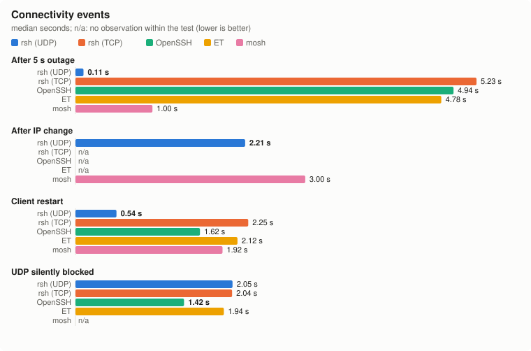

| Event | Tool | Observed | Time s | Same shell | Errors |
| --- | --- | --- | --- | --- | --- |
| After 5 s outage | rsh (UDP) | 2/2 | 0.11 | — | 0 |
| After 5 s outage | rsh (TCP) | 2/2 | 5.23 | — | 0 |
| After 5 s outage | OpenSSH | 2/2 | 4.94 | — | 0 |
| After 5 s outage | ET | 2/2 | 4.78 | — | 0 |
| After 5 s outage | mosh | 2/2 | 1.00 | — | 0 |
| After IP change | rsh (UDP) | 2/2 | 2.21 | — | 0 |
| After IP change | rsh (TCP) | 0/2 | — | — | 0 |
| After IP change | OpenSSH | 0/2 | — | — | 0 |
| After IP change | ET | 0/2 | — | — | 0 |
| After IP change | mosh | 2/2 | 3.00 | — | 0 |
| Client restart | rsh (UDP) | 2/2 | 0.54 | 2/2 | 0 |
| Client restart | rsh (TCP) | 2/2 | 2.25 | 2/2 | 0 |
| Client restart | OpenSSH | 2/2 | 1.62 | 0/2 | 0 |
| Client restart | ET | 2/2 | 2.12 | 0/2 | 0 |
| Client restart | mosh | 2/2 | 1.92 | 0/2 | 0 |
| UDP silently blocked | rsh (UDP) | 2/2 | 2.05 | — | 0 |
| UDP silently blocked | rsh (TCP) | 2/2 | 2.04 | — | 0 |
| UDP silently blocked | OpenSSH | 2/2 | 1.42 | — | 0 |
| UDP silently blocked | ET | 2/2 | 1.94 | — | 0 |
| UDP silently blocked | mosh | 0/2 | — | — | 2 |

Restart time alone does not establish session continuity: see Same shell. A missing roaming response within eight seconds is a censored observation, not a measured infinite recovery time. UDP-block mosh failures are retained, consistent with its UDP-only transport.

## 10. Moving network

Each scene runs for 60 seconds with two shared 30-second delay/rate/outage
cycles. There are two evaluations per cohort. Four sessions run concurrently
in 100×30 workload PTYs; the403×32 virtual viewer is continuously drained.
One cohort uses rsh UDP and another rsh TCP alongside SSH, ET and mosh.
All moving tools use the same 400×200 pyte header observer, distinct from the
100×30 workload PTYs.
Shared tools are kept separate across cohorts. Moving is descriptive and is not pooled with static results. Replay application
skew is recorded; exact global timing fidelity is not assumed.
Loss fractions here describe intervals of complete outage, not independent
per-packet random loss. No GPU presentation or radio-network claim follows.

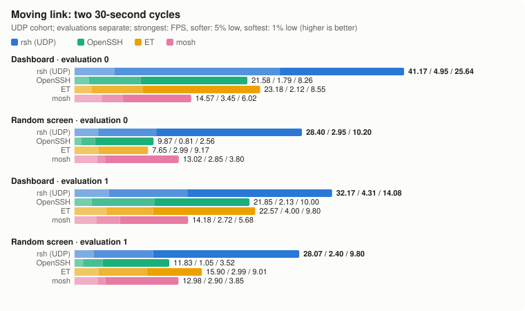

| Cohort | Evaluation | Scene | Tool | Avg FPS | 1% low | 5% low | Age ms | Maxgap ms | Scene RX MiB | Client RSS MiB | Server RSS MiB | End marker |
| --- | --- | --- | --- | --- | --- | --- | --- | --- | --- | --- | --- | --- |
| UDP | 0 | Dashboard | OpenSSH | 21.58 | 1.79 | 8.26 | 351 | 2483 | 13.23 | 7.82 | 19.74 | seen |
| UDP | 0 | Dashboard | ET | 23.18 | 2.12 | 8.55 | 315 | 4287 | 14.14 | 18.16 | 31.18 | seen |
| UDP | 0 | Dashboard | mosh | 14.57 | 3.45 | 6.02 | 57 | 1987 | 0.60 | 14.46 | 20.49 | seen |
| UDP | 0 | Dashboard | rsh (UDP) | 41.17 | 4.95 | 25.64 | 59 | 1431 | 1.47 | 2.92 | 5.59 | seen |
| UDP | 0 | Random screen | OpenSSH | 9.87 | 0.81 | 2.56 | 56 | 3469 | 10.13 | 7.44 | 18.38 | seen |
| UDP | 0 | Random screen | ET | 7.65 | 2.99 | 9.17 | 60 | 36477 | 126.19 | 24.52 | 81.42 | not seen |
| UDP | 0 | Random screen | mosh | 13.02 | 2.85 | 3.80 | 72 | 747 | 4.20 | 14.14 | 20.24 | seen |
| UDP | 0 | Random screen | rsh (UDP) | 28.40 | 2.95 | 10.20 | 62 | 1896 | 9.98 | 2.95 | 5.41 | seen |
| UDP | 1 | Dashboard | OpenSSH | 21.85 | 2.13 | 10.00 | 486 | 5613 | 13.18 | 7.74 | 19.41 | seen |
| UDP | 1 | Dashboard | ET | 22.57 | 4.00 | 9.80 | 337 | 6775 | 17.67 | 18.05 | 327.08 | seen |
| UDP | 1 | Dashboard | mosh | 14.18 | 2.72 | 5.68 | 58 | 2108 | 0.60 | 14.45 | 27.20 | seen |
| UDP | 1 | Dashboard | rsh (UDP) | 32.17 | 4.31 | 14.08 | 56 | 2019 | 1.12 | 2.81 | 5.59 | seen |
| UDP | 1 | Random screen | OpenSSH | 11.83 | 1.05 | 3.52 | 62 | 6913 | 11.42 | 7.72 | 17.82 | seen |
| UDP | 1 | Random screen | ET | 15.90 | 2.99 | 9.01 | 1390 | 9167 | 129.85 | 55.32 | 407.37 | not seen |
| UDP | 1 | Random screen | mosh | 12.98 | 2.90 | 3.85 | 70 | 754 | 4.20 | 13.66 | 27.26 | seen |
| UDP | 1 | Random screen | rsh (UDP) | 28.07 | 2.40 | 9.80 | 61 | 3068 | 9.90 | 2.89 | 5.38 | seen |

UDP cohort maximum replay application skew: 57.87ms.

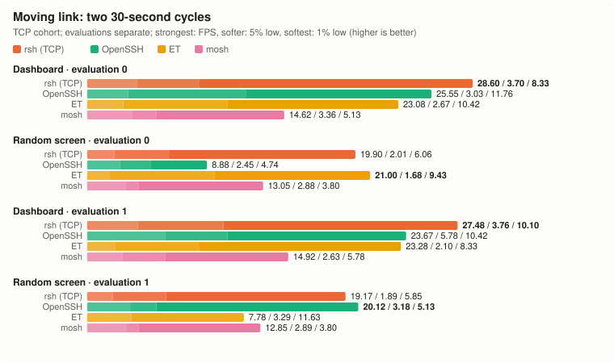

| Cohort | Evaluation | Scene | Tool | Avg FPS | 1% low | 5% low | Age ms | Maxgap ms | Scene RX MiB | Client RSS MiB | Server RSS MiB | End marker |
| --- | --- | --- | --- | --- | --- | --- | --- | --- | --- | --- | --- | --- |
| TCP | 0 | Dashboard | OpenSSH | 25.55 | 3.03 | 11.76 | 877 | 5187 | 16.98 | 7.82 | 20.14 | seen |
| TCP | 0 | Dashboard | ET | 23.08 | 2.67 | 10.42 | 400 | 13627 | 13.16 | 17.96 | 461.48 | seen |
| TCP | 0 | Dashboard | mosh | 14.62 | 3.36 | 5.13 | 59 | 1263 | 0.60 | 14.34 | 36.33 | seen |
| TCP | 0 | Dashboard | rsh (TCP) | 28.60 | 3.70 | 8.33 | 53 | 1683 | 0.86 | 2.22 | 5.34 | seen |
| TCP | 0 | Random screen | OpenSSH | 8.88 | 2.45 | 4.74 | 52 | 20170 | 8.97 | 7.93 | 18.66 | seen |
| TCP | 0 | Random screen | ET | 21.00 | 1.68 | 9.43 | 1313 | 5448 | 19.90 | 19.20 | 480.64 | seen |
| TCP | 0 | Random screen | mosh | 13.05 | 2.88 | 3.80 | 70 | 749 | 4.23 | 14.46 | 37.01 | seen |
| TCP | 0 | Random screen | rsh (TCP) | 19.90 | 2.01 | 6.06 | 63 | 1849 | 6.38 | 2.29 | 5.38 | seen |
| TCP | 1 | Dashboard | OpenSSH | 23.67 | 5.78 | 10.42 | 385 | 12095 | 12.94 | 8.00 | 19.45 | seen |
| TCP | 1 | Dashboard | ET | 23.28 | 2.10 | 8.33 | 409 | 1635 | 16.42 | 18.00 | 500.02 | seen |
| TCP | 1 | Dashboard | mosh | 14.92 | 2.63 | 5.78 | 58 | 1068 | 0.61 | 14.04 | 47.57 | seen |
| TCP | 1 | Dashboard | rsh (TCP) | 27.48 | 3.76 | 10.10 | 52 | 1813 | 0.82 | 2.41 | 5.32 | seen |
| TCP | 1 | Random screen | OpenSSH | 20.12 | 3.18 | 5.13 | 1078 | 3248 | 19.07 | 8.28 | 19.44 | seen |
| TCP | 1 | Random screen | ET | 7.78 | 3.29 | 11.63 | 57 | 40827 | 124.75 | 29.20 | 539.90 | not seen |
| TCP | 1 | Random screen | mosh | 12.85 | 2.89 | 3.80 | 71 | 1336 | 4.22 | 13.08 | 47.48 | seen |
| TCP | 1 | Random screen | rsh (TCP) | 19.17 | 1.89 | 5.85 | 64 | 2185 | 6.15 | 2.31 | 5.38 | seen |

TCP cohort maximum replay application skew: 72.29ms.

Scene RX includes warmup/drain outside the common FPS window, so it is
not a 60-second RX rate. Moving RSS is the larger of midpoint/end samples,
not peak RSS; static RSS uses the midpoint sample. FPS is the observed frame
arrival rate, including backlog catch-up. Age and the full frame timelines
help distinguish fresh delivery from replay. Sparse lows remain missing.
The end-marker column preserves clients that did not show the scene end within
the unchanged 120-second drain limit; that drain is outside the FPS window.

## Collection failures and limitations

| Source | Test | Link | Scene | Tool | Iteration | Error |
| --- | --- | --- | --- | --- | --- | --- |
| full-suite | flood | badmobile | — | rsh (TCP) | 1 | no prompt |
| full-suite | udpblock | wan | — | mosh | 0 | no prompt |
| full-suite | udpblock | wan | — | mosh | 1 | no prompt |
| full-suite | render | badmobile | compress | rsh (TCP) | 1 | no prompt |

Static render jobs: 199/200 measured; switch jobs: 100/100 measured. All tests use the same full batch. Collection failures: 4; expected mosh UDP-block no-prompt cases: 2. No failed job was silently converted to a numeric result.

Results cover synthetic isolated paths on one shared host, not fairness with cross traffic, real radio traces, independent hardware replications or statistical confidence intervals. Static nominal loss percentages do not guarantee equal realized drops across protocols. High average FPS can coexist with worse tails; compare the average and percentile columns separately. No universal win or non-regression claim is made.

## Data and reproduction

| Source run | Jobs | Used for | Original SHA-256 |
| --- | --- | --- | --- |
| full-suite.json | 550 | echo, flood, outage, reattach, render, roam, sessions, switch, udpblock | 285c2281745c90b476ed0605ca24e0a8be4b66e0c091fb633425c84cbef45c3c |

The [static snapshot](docs/bench/data/v0.3.0/static.json) contains the complete
batch, options, frame gaps, resource samples and errors. Separate moving
[UDP](docs/bench/data/v0.3.0/moving-udp.json) and
[TCP](docs/bench/data/v0.3.0/moving-tcp.json) snapshots retain both evaluations,
raw frame observations, windows, scene counters and network replay traces.
The [environment manifest](docs/bench/data/v0.3.0/environment.json) records
host/VM configuration, package and executable identities, source/harness hashes
and actual test commands. No older comparison supplies values to this report.

Regenerate this report, the README tables and every linked chart from the
committed snapshots:

```sh
python3 benchmark/lab/report.py
```

Collect the full static workload with four jobs and two evaluations:

```sh
scripts/dist.sh
python3 benchmark/harness/run.py build
python3 benchmark/lab/lab.py run --tools ssh,et,mosh,rsh,rsh-tcp \
  --tests render,switch,echo,flood,outage,roam,reattach,udpblock,sessions \
  --nets lan,wan,lowbw,mid5,verylow,slow64k,highlat,lossy,mobile,badmobile \
  --switches lan:highlat,lan:lowbw,lowbw:highlat,highlat:lossy,wan:verylow \
  --scenes compress,bandwidth --fps 60 --duration 8 --iterations 2 \
  --sessions 10 --session-iterations 2 --cols 100 --rows 30 --parallel 4
```

For moving, run each transport cohort twice, with a 403×32 viewer producing
four 100×30 workload panes. The actual pane/source dimensions are recorded;
`--cols`/`--rows` alone do not set demo geometry.

```sh
python3 benchmark/lab/lab.py demo --tools ssh,et,mosh,rsh --events '' \
  --nets moving --scenes compress,bandwidth --fps 60 --duration 60
python3 benchmark/lab/lab.py demo --tools ssh,et,mosh,rsh-tcp --events '' \
  --nets moving --scenes compress,bandwidth --fps 60 --duration 60
```

## References

The [README references](README.md#references) connect sender/receiver mechanisms
to their research sources. These measurements come from the repository's
Docker/netem/terminal collectors.
